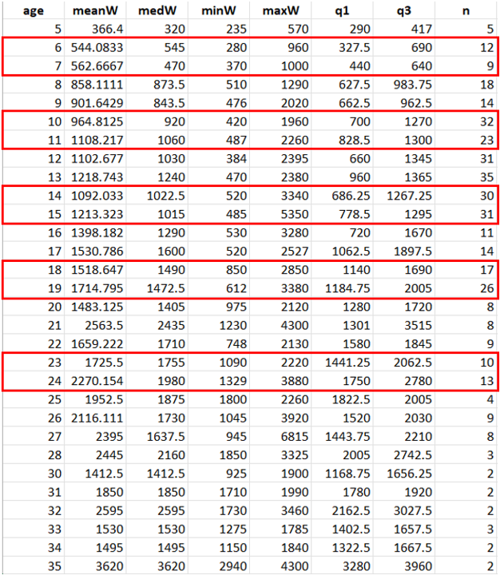

# Code Accessibility

## [Working on GitHub to keep everything in one place]{.underline}

- Using `r R.version.string`.

  - Quarto is being used to create slides. This way, the R code for all plots in this presentation can be accessed at all times. The code is embedded in the pptx file, but they are not shown (see below).

- View the code and download the data used for this presentation in the GitHub repository: <https://github.com/StefTasayco/Lake-Trout-AK.git>

  - The file name is "Age-weight.qmd"

```{r}
#| label: setup
#| message: false

# load packages
library(ggplot2)
library(dplyr)
library(writexl)
library(janitor)
library(readxl)
library(forcats)
library(RColorBrewer)
library(lubridate)
library(patchwork)
library(plotly)
library(gganimate)

# load color-blind friendly palettes
my_paired <- RColorBrewer::brewer.pal(12, "Paired")
my_paired13 <- colorRampPalette(brewer.pal(12, "Paired"))(13)

# load data
datafull <- read_excel("data/lake_trout_datafull.xlsx")
```

# Lake Trout Age-Weight

::::: columns
::: column
**Boxplots of weight at age** capture the range of possible model input values.

This analysis contributes to the approach that we discussed during the last Lake Trout team meeting where:

- We combine all available lake trout data and pick an age that has robust data (e.g. 10, 20, 30).

  - Lake trout follow the [von Bertalanffy growth model](https://en.wikipedia.org/wiki/Von_Bertalanffy_function) (VBGM). aka their growth should plateau as they grow older.

  - Therefore, we expect that age 10 lake trout will have a higher growth and consumption rate than age 30 lake trout.
:::

::: column
- The design profiles (one per age) are made using median and quartile weights for each age.

  - Run names for these design profiles are shown in the table.

- These weight ranges represent our "generic lake trout" to use for all lakes.

```{r}
run_names <- read_excel("data/metadata.xlsx", sheet = "age_weight_runnames")
run_names
```
:::
:::::

# Boxplots of weight at age

::::: columns
::: column
```{r}
# data after 35 years of age is very scarce so I omitted it
datafull <- datafull |>
  filter(age <= 35, !is.na(age), is.finite(weight_g))

# creating a boxplot with all lake trout data available
boxplot_filtered <- datafull |>
  group_by(age) |>
  filter(n() > 1) |> # excluding ages that only have 1 entry
  ungroup() |>
  mutate(age = factor(age, levels = sort(unique(age))))

boxplot <- boxplot_filtered |>
  ggplot() +
  aes(x = age, y = weight_g, group = age) +
  geom_boxplot() +
  labs(
    x = "Age",
    y = "Weight (g)",
    title = "Weight at Age (all data)"
  ) +
  theme_bw() +
  theme(
    plot.title = element_text(face = "bold", hjust = 0.5)
  )
boxplot
```
:::

::: column
```{r}
# printing the summary stats for weight at age and omitting ages that contain less than 2 entries
summary <- datafull |>
  group_by(age) |>
  filter(n() > 1) |>
  summarise(
    meanW = mean(weight_g),
    medW = median(weight_g),
    minW = min(weight_g),
    maxW = max(weight_g),
    q1 = quantile(weight_g, probs = 0.25),
    q3 = quantile(weight_g, probs = 0.75),
    n = n(),
    .groups = "drop"
  )

# saving these summary stats to be accessible on GitHub
write_xlsx(summary, "data/summary_stats.xlsx")

summary_stats <- 
summary_stats
```
:::
:::::

# General lake trout per lake

## Lake Clark

- The first design profile was made using surface water temperatures from Lake Clark. A new temperature profile was made for Lake CLark to include all surface temperatures from all years.

- The mean temperature for each day of year was taken and used for the temperature file. 9C becomes available on May 22nd and ends on Dec. 21st.

  - May 22 -Dec 21 the temperature was set to 9C.

  - All other days = mean surface temperatures from full dataset.

```{r}
# load Lake Clark surface temp data
LAC_surface_all <- read_excel("data/Lake_Clark_all_surface.xlsx")

LAC_surface_all <- LAC_surface_all |>
  mutate(date = mdy(date)) |>
  mutate(day_of_the_year = yday(date)) |>
  mutate(year = factor(year))

# plot all surface temp
p_surface <- LAC_surface_all |>
  ggplot() +
  aes(x = day_of_the_year, y = t_surface, color = year) +
  geom_point() +
  #creates black line at 9C which is lake trout preferred temperature
  geom_hline(
    data = ~.x,
    mapping = aes(yintercept = 9)
  ) +
  labs(
    title = "Lake Clark – Surface Water Temperature",
    x = "Day of the year",
    y = "Temperature (°C)",
    color = "Year",
    caption = "Days of the year include 365 days out of the year. The black line shows 9C."
  ) +
  theme_grey()
p_surface

# interactive plot only renders in html file not pptx
# (p_surface + aes(label = date)) |>
#   ggplotly(dynamicTicks = TRUE)


# generic surface temps for Lake Clark using the average temp for each day of the year. 

generic_LAC <- LAC_surface_all |>
  filter(!is.na(t_surface)) |>
  mutate(day = coalesce(day_of_the_year, doy)) |>
  group_by(day) |>
  summarise(
    mean_temp = mean(t_surface, na.rm = TRUE),
    n_obs = dplyr::n(),
    sd_temp = sd(t_surface, na.rm = TRUE),
    .groups = "drop"
  )
write_xlsx(generic_LAC, "data/mean_LakeClark_surface_temps.xlsx")


# finding out the average day of year when the ice freezes over
freezeup_date <- LAC_surface_all |>
  filter(event == "freezeup_date") # mean day of year is day 18

# finding out the average day of year when the ice breaks up
breakup_date <- LAC_surface_all |>
  filter(event == "breakup_date") |>
  mutate(mean_doy = mean(day_of_the_year)) # mean = day 117
```

# FB4 Output

::::: columns
::: column
```{r}
# load output data
fb4_output <- read_excel("data/Generic_LAC_Scen1a_beta_Output.xlsx")
fb4_output <- fb4_output |>
  clean_names()
```

Key takeaways:

- These two plots do not support my initial assumption that younger lake trout have a higher growth rates. Age 6 has the lowest growth rate, while age 23 has the highest growth rate.
- The interpretations for each run name is consistent with their p-values. For example:
  - age_14_med_med (typical growth) p-value = 0.33083
  - age_14_q1_q1 (steady growth at the low end of their mass) p-value = 0.381905
  - age_14_q3_q3 (steady growth at the upper end of their mass) p-value = 0.351765
  - age_14_q1_q3 (rapid growth) = 0.668207
  - age_14_q3_q1 (mass loss) = 0.086254

```{r}
#prefixes to include in function for making daily growth plots
age_prefixes <- c("Age 6", "Age 10", "Age 14", "Age 18", "Age 23")

avg_growth_rate_per_day <- fb4_output |>
  mutate(
    run_name = as.character(run_name),
    age_prefix = {
      digits <- stringr::str_match(run_name, "(?i)^age[^0-9]*0*(\\d+)")[,2]
      ifelse(!is.na(digits), paste("Age", as.integer(digits)), NA_character_)
    }
  ) |>
  filter(age_prefix %in% age_prefixes) |>
  group_by(age_prefix, day) |>
  summarize(
    mean_sgr = mean(`specific_growth_rate_j_g_d`, na.rm = TRUE),
    sd_sgr = sd(`specific_growth_rate_j_g_d`, na.rm = TRUE),
    n_obs = sum(!is.na(`specific_growth_rate_j_g_d`)),
    se_sgr = ifelse(n_obs > 1, sd_sgr / sqrt(n_obs), NA_real_),
    .groups = "drop"
  )

#plotting growth rate (J/g/d)
growth_rate_Jgd <- avg_growth_rate_per_day |>
  ggplot() +
  aes(x = day, y = mean_sgr, color = age_prefix) +
  geom_line() +
  labs(
    y = "Avg specific growth rate (J/g/d)",
    color = "Age of fish",
    title = "Lake Trout Daily Growth Rate (energy) in Lake Clark"
  ) +
  theme_minimal() +
  theme(
    plot.title = element_text(face = "bold", hjust = 0.5)
  )

growth_rate_Jgd
```
:::

::: column
- Next steps:
  - Creating temp profiles for Kijik Lake and Chelle Lake using same methods as above.
  - Calculating growing degree days (GDD) for each lake and using GDD as a predictor variable to compare FB4 outputs (each output represents a lake)
  - Looking through new temp data that Krista sent and plotting a thermocline for Lake Clark, Kijik, and Chelle first.
  - Keep looking around in literature for more diet data. I've been using the same diet schedule and I want to play around with the diets more.

```{r}
#doing the same thing as above but in g/g/d instead of J/g/d
avg_growth_rate_ggd <- fb4_output |>
  mutate(
    run_name = as.character(run_name),
    age_prefix = {
      digits <- stringr::str_match(run_name, "(?i)^age[^0-9]*0*(\\d+)")[,2]
      ifelse(!is.na(digits), paste("Age", as.integer(digits)), NA_character_)
    }
  ) |>
  filter(age_prefix %in% age_prefixes) |>
  group_by(age_prefix, day) |>
  summarize(
    mean_sgr = mean(`specific_growth_rate_g_g_d`, na.rm = TRUE),
    sd_sgr = sd(`specific_growth_rate_g_g_d`, na.rm = TRUE),
    n_obs = sum(!is.na(`specific_growth_rate_g_g_d`)),
    se_sgr = ifelse(n_obs > 1, sd_sgr / sqrt(n_obs), NA_real_),
    .groups = "drop"
  )

# plotting growth rate (g/g/d)
growth_rate_ggd <- avg_growth_rate_ggd |>
  ggplot() +
  aes(x = day, y = mean_sgr, color = age_prefix) +
  geom_line() +
  labs(
    y = "Avg specific growth rate (g/g/d)",
    color = "Age of fish",
    title = "Lake Trout Daily Growth Rate (mass) in Lake Clark"
  ) +
  theme_minimal() +
  theme(
    plot.title = element_text(face = "bold", hjust = 0.5)
  )

growth_rate_ggd

```
:::
:::::

# References

::: {#refs}
:::